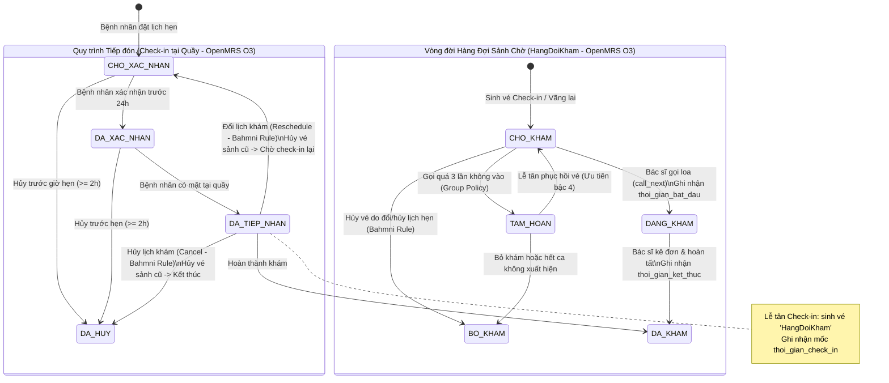
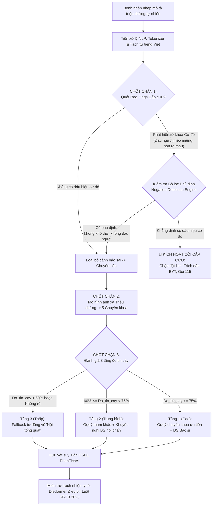

# MA TRẬN TRUY VẾT NGUỒN VÀ THAM CHIẾU HỆ THỐNG
## DỰ ÁN HỆ THỐNG QUẢN LÝ PHÒNG KHÁM NGOẠI TRÚ & PHÂN LUỒNG KHÁM BỆNH (AI TRIAGE)

> **Tài liệu căn cứ kỹ thuật & học thuật**  
> **Phiên bản:** 3.0  
> **Cập nhật:** 10/2026  
> **Áp dụng:** Báo cáo Đồ án Project 1, Mã nguồn Backend FastAPI và Kiến trúc CSDL PostgreSQL.

---

### MỤC LỤC
1. [Giới thiệu & Nguyên tắc phân tách 3 nguồn tham chiếu và Chính sách nhóm](#1-giới-thiệu--nguyên-tắc-phân-tách-3-nguồn-tham-chiếu-và-chính-sách-nhóm)
2. [Bảng 1: Đối chiếu Nghiệp vụ 3 Hệ thống (Bahmni, OpenMRS O3, OpenEMR) và Chính sách nhóm](#2-bảng-1-đối-chiếu-nghiệp-vụ-3-hệ-thống-bahmni-openmrs-o3-openemr-và-chính-sách-nhóm)
3. [Bảng 2: Danh mục Red Flags trích dẫn Phác đồ Bộ Y Tế (kcb.vn)](#3-bảng-2-danh-mục-red-flags-trích-dẫn-phác-đồ-bộ-y-tế-kcbvn)
4. [Bảng 3: Kiến trúc AI Triage tham chiếu mô hình chuẩn Infermedica](#4-bảng-3-kiến-trúc-ai-triage-tham-chiếu-mô-hình-chuẩn-infermedica)
5. [Bảng 4: Phân tích giới hạn DDXPlus & Bộ Benchmark 50 Ca lâm sàng độc lập](#5-bảng-4-phân-tích-giới-hạn-ddxplus--bộ-benchmark-50-ca-lâm-sàng-độc-lập)
6. [Ma trận phân quyền tác nhân (RBAC Matrix)](#6-ma-trận-phân-quyền-tác-nhân-rbac-matrix)
7. [Kết quả Kiểm thử Tự động 100% Passed](#7-kết-quả-kiểm-thử-tự-động-100-passed)

---

### 1. GIỚI THIỆU & NGUYÊN TẮC PHÂN TÁCH 3 NGUỒN THAM CHIẾU VÀ CHÍNH SÁCH NHÓM

Nhằm đảm bảo tính đúng đắn học thuật, sự chặt chẽ về mặt nghiệp vụ y tế và tính khả thi trong kỹ thuật phần mềm, hệ thống tuân thủ nguyên tắc **tách bạch tuyệt đối giữa các hệ thống mã nguồn mở y tế quốc tế và Chính sách điều phối nội bộ do nhóm đề xuất**, không đánh đồng hoặc gán nhãn sai:

```
┌──────────────────────────────────────────────────────────────────────────────────────────────┐
│                    MA TRẬN ĐỐI CHIẾU 3 HỆ THỐNG MÃ NGUỒN MỞ & CHÍNH SÁCH NHÓM                │
├─────────────────────┬─────────────────────────────────────┬──────────────────────────────────┤
│ HỆ THỐNG THAM CHIẾU │ PHẠM VI NGHIỆP VỤ ĐỐI CHIẾU         │ QUY TẮC CỐT LÕI ĐƯỢC ÁP DỤNG     │
├─────────────────────┼─────────────────────────────────────┼──────────────────────────────────┤
│ 1. Bahmni           │ Vòng đời Lịch hẹn đặt trước         │ • Lịch đã Check-in nếu đổi lịch  │
│    (Appointment     │ (Creating & Managing Appointments)  │   (reschedule): vé hàng đợi cũ bị│
│     Scheduling)     │                                     │   ĐÓNG/HỦY, lịch mới quay về     │
│                     │                                     │   Scheduled (phải check-in lại). │
│                     │                                     │ • Khi hủy lịch, vé hàng đợi bị   │
│                     │                                     │   hủy theo để giải phóng sảnh.   │
├─────────────────────┼─────────────────────────────────────┼──────────────────────────────────┤
│ 2. OpenMRS O3       │ Quản lý Hàng đợi Ngoại trú          │ • Chỉ bệnh nhân ĐÃ CÓ MẶT        │
│    (Service Queues  │ (Service Queues in O3)              │   mới được đưa vào hàng đợi khám.│
│     in O3)          │                                     │ • Lưu trữ đủ 4 mốc thời gian:    │
│                     │                                     │   Check-in, Gọi loa, Khám, Xong. │
│                     │                                     │ • Tách hàng đợi theo Dịch vụ/Khoa│
├─────────────────────┼─────────────────────────────────────┼──────────────────────────────────┤
│ 3. OpenEMR          │ Bảng luân chuyển người bệnh         │ • Patient Flow Board: theo dõi   │
│    (Patient Flow    │ (Arrival to Departure Tracking)     │   Giờ hẹn vs Giờ đến thực tế,    │
│     Board / V7)     │                                     │   Thời gian chờ (Wait Time),     │
│                     │                                     │   Thời gian ở trạng thái này,    │
│                     │                                     │   Bác sĩ/Phòng phụ trách.        │
├─────────────────────┼─────────────────────────────────────┼──────────────────────────────────┤
│ 4. OpenMRS Model    │ Mô hình đợt khám Visit - Encounter  │ • Thừa nhận mô hình giản lược    │
│                     │                                     │   MVP: 1 LuotKham xuyên suốt đợt │
│                     │                                     │   khám (khám ban đầu -> CLS ->   │
│                     │                                     │   kết luận & đơn thuốc).         │
├─────────────────────┼─────────────────────────────────────┼──────────────────────────────────┤
│ ⭐ CHÍNH SÁCH NHÓM  │ Thuật toán điều phối phòng khám     │ • Khung giờ tiếp đón: 30 phút/ca │
│    ĐỀ XUẤT (POLICY) │ ngoại trú tại Việt Nam              │ • Ngưỡng đến muộn: 15 phút       │
│                     │                                     │ • Gọi loa quá 3 lần: Tạm hoãn    │
│                     │                                     │ • Thuật toán 5 bậc ưu tiên       │
└─────────────────────┴─────────────────────────────────────┴──────────────────────────────────┘
```

---

### 2. BẢNG 1: ĐỐI CHIẾU NGHIỆP VỤ 3 HỆ THỐNG (BAHMNI, OPENMRS O3, OPENEMR) VÀ CHÍNH SÁCH NHÓM

#### 2.1. Phân biệt `LichKham` (Bahmni) vs `HangDoiKham` (OpenMRS O3)

| Tiêu chí | Lịch hẹn trước (`LichKham` / `appointments`) | Hàng đợi thực tế (`HangDoiKham` / `patient_queue`) |
| :--- | :--- | :--- |
| **Hệ thống tham chiếu** | **Bahmni Appointment Scheduling** | **OpenMRS O3 Service Queues** |
| **Bản chất** | Cam kết thời gian dự kiến giữa người bệnh và cơ sở y tế. | Trạng thái luân chuyển người bệnh tại sảnh chờ và phòng khám. |
| **Thời điểm sinh ra** | Khi người bệnh hoàn tất đặt lịch trên ứng dụng / web. | Khi người bệnh đến quầy tiếp đón và thực hiện **Check-in**. |
| **Vị trí vật lý** | Chưa xác định người bệnh có mặt tại phòng khám hay không. | Xác nhận người bệnh đang có mặt tại sảnh chờ phòng khám. |
| **Thời gian hiệu lực**| Khung giờ khám dự kiến (Estimated Arrival Window - 30 phút). | Thứ tự xếp hàng và lượt gọi thực tế trong ca làm việc. |
| **Tác nhân quản lý** | Bệnh nhân đặt, Lễ tân/Admin xác nhận hoặc hủy/đổi lịch. | Lễ tân check-in/phục hồi vé, Bác sĩ gọi khám/tạm hoãn. |

#### 2.2. Vòng đời Lịch hẹn Bahmni: Quy tắc Đổi/Hủy lịch sau Check-in

Tham chiếu theo tài liệu chính thức *Bahmni Creating and Managing Appointments*:
- **Đổi lịch sau Check-in (`reschedule_booking`)**: Khi bệnh nhân đã check-in nhưng phát sinh việc bận cần dời ngày khám:
  - Bản ghi `HangDoiKham` cũ đang chờ (`CHO_KHAM` hoặc `TAM_HOAN`) được tự động cập nhật sang `BO_KHAM`, giải phóng ngay màn hình chờ của bác sĩ.
  - Bản ghi `LichKham` dời sang ngày/giờ mới và quay về trạng thái `CHO_XAC_NHAN` (Scheduled).
  - Khi đến ngày mới, bệnh nhân bắt buộc phải Check-in lại tại quầy tiếp đón để được cấp số thứ tự mới.
- **Hủy lịch sau Check-in (`cancel_booking`)**: Khi hủy lịch hẹn, vé hàng đợi đang chờ tự động được chuyển sang `BO_KHAM` để đảm bảo sảnh chờ không bị tồn tại vé ma (Ghost Queue Ticket).



#### 2.3. Dấu mốc thời gian luân chuyển bệnh nhân (Chuẩn OpenMRS O3)

Hệ thống lưu trữ và bảo toàn 4 mốc thời gian phục vụ phân tích hiệu suất và đo lường tắc nghẽn:
1. `thoi_gian_check_in`: Thời điểm lễ tân xác nhận người bệnh có mặt thực tế tại cơ sở y tế.
2. `thoi_gian_goi_kham`: Thời điểm bác sĩ bấm chuông/gọi loa gọi bệnh nhân vào phòng khám.
3. `thoi_gian_bat_dau`: Thời điểm bệnh nhân thực tế bước vào phòng khám và bác sĩ bắt đầu khám.
4. `thoi_gian_ket_thuc`: Thời điểm bác sĩ kết luận chẩn đoán, hoàn tất đơn thuốc và khóa ca khám.

#### 2.4. Bảng điều phối luân chuyển người bệnh (Chuẩn OpenEMR Patient Flow Board)

Tham chiếu *OpenEMR Patient Flow Board (Flowboard V7)*, hệ thống cung cấp API `GET /api/v1/reception/flow-board` trả về bảng điều phối đa chiều phục vụ Lễ tân và Bác sĩ:
- **Giờ hẹn dự kiến (`gio_hen_du_kien`)**: Khung giờ bệnh nhân đăng ký ban đầu (vd: 08:30).
- **Giờ đến thực tế (`thoi_gian_check_in`)**: Thời điểm check-in tại quầy.
- **Tổng thời gian chờ (`thoi_gian_cho_phut`)**: $T_{\text{hiện tại}} - T_{\text{check-in}}$.
- **Thời gian ở trạng thái hiện tại (`thoi_gian_o_trang_thai_phut`)**: 
  - Đang khám: $T_{\text{hiện tại}} - T_{\text{bắt đầu khám}}$.
  - Đã khám: $T_{\text{kết thúc}} - T_{\text{bắt đầu khám}}$.
  - Đang chờ: bằng thời gian chờ.
- **Bác sĩ & Phòng khám phụ trách**.

#### 2.5. Chính sách điều phối phòng khám ngoại trú do nhóm đề xuất (Group Clinic Policy)

Nhóm **tự nhận thức và phân định rõ ràng** các quy tắc sau là chính sách điều phối nội bộ do nhóm đề xuất dựa trên khảo sát thực tế phòng khám ngoại trú tại Việt Nam, không phải chuẩn quốc tế:
1. **Khung giờ tiếp đón 30 phút**: Ca sáng 8 slot (07:30 - 11:30), Ca chiều 7 slot (13:30 - 17:00), chuẩn hóa 15 lượt khám/bác sĩ/ngày.
2. **Ngưỡng đến muộn 15 phút**: Bệnh nhân đến trong 15 phút đầu của slot được xếp đúng hẹn (Bậc 2); đến sau 15 phút chuyển sang đến muộn (Bậc 5).
3. **Quy tắc tạm hoãn sau 3 lần gọi**: Bác sĩ gọi loa 3 lần nếu bệnh nhân không vào thì chuyển sang `TAM_HOAN`. Lễ tân có quyền phục hồi vé khi bệnh nhân quay lại (xếp Bậc 4).
4. **Thuật toán điều phối 5 bậc ưu tiên**:
   - **Bậc 1**: Cấp cứu / Cờ đỏ Red Flag (QĐ Bộ Y Tế).
   - **Bậc 2**: Đặt hẹn trước đúng giờ đã check-in.
   - **Bậc 3**: Trả kết quả cận lâm sàng (quay lại kết luận).
   - **Bậc 4**: Đến sớm trước khung giờ hoặc vé tạm hoãn được phục hồi.
   - **Bậc 5**: Khách vãng lai (`walk_in`) hoặc bệnh nhân đến trễ > 15 phút.

---

### 3. BẢNG 2: DANH MỤC RED FLAGS TRÍCH DẪN PHÁC ĐỒ BỘ Y TẾ (KCB.VN)

Hệ thống **không tự ý suy diễn** các dấu hiệu cấp cứu mà dẫn chiếu trực tiếp từ các Quyết định và Thông tư chuyên môn của Bộ Y Tế Việt Nam:

| STT | Triệu chứng cờ đỏ (Red Flags) | Nhóm bệnh lý cảnh báo | Mã ICD-10 | Văn bản pháp quy Bộ Y Tế tham chiếu |
| :---: | :--- | :--- | :---: | :--- |
| **1** | Đau thắt ngực dữ dội, cảm giác bóp nghẹt lan lên vai/hàm trái, kèm vã mồ hôi lạnh | Nhồi máu cơ tim cấp, Hội chứng vành cấp | **I21** *(I21.0 - I21.9)* | **Quyết định số 1857/QĐ-BYT** ngày 18/04/2023 của Bộ Y tế về việc ban hành Hướng dẫn chẩn đoán và xử trí hội chứng vành cấp và suy tim. |
| **2** | Khó thở dữ dội, tím tái môi đầu chi, thở rít, co kéo cơ hô hấp phụ, SpO2 < 92% | Cơn hen phế quản ác tính, Đợt cấp COPD nặng, Suy hô hấp cấp | **J44.1**, **J45.9** | **Quyết định số 2767/QĐ-BYT** ngày 04/07/2023 của Bộ Y tế về Hướng dẫn chẩn đoán và điều trị Bệnh phổi tắc nghẽn mạn tính (COPD). |
| **3** | Méo miệng một bên, liệt hoặc yếu nửa người, nói đớ, mất khả năng nói, rối loạn tri giác (Dấu hiệu FAST) | Tai biến mạch máu não, Đột quỵ não cấp | **I63**, **I64** | **Quyết định số 3878/QĐ-BYT** ngày 07/09/2020 của Bộ Y tế ban hành Hướng dẫn chẩn đoán và xử trí đột quỵ não. |
| **4** | Nôn ra máu đỏ tươi, đi ngoài phân đen nhầy bóng như bã cà phê kèm chóng mặt, tụt huyết áp | Xuất huyết tiêu hóa cao (Loét dạ dày tá tràng, vỡ giãn tĩnh mạch thực quản) | **K92.0**, **K92.1** | Hướng dẫn chẩn đoán và điều trị các bệnh về tiêu hóa ban hành kèm theo **Quyết định số 3614/QĐ-BYT** của Bộ Y tế. |
| **5** | Khó thở đột ngột kèm phù mí mắt, môi sưng to, nổi mề đay toàn thân sau dùng thuốc hoặc thức ăn | Phản vệ cấp độ 2 trở lên (Sốc phản vệ) | **T78.2** | **Thông tư số 51/2017/TT-BYT** ngày 29/12/2017 của Bộ Y tế ban hành Hướng dẫn phòng, chẩn đoán và xử trí phản vệ. |
| **6** | Hôn mê, lơ mơ, co giật, cứng gáy, sốt cao mê sảng không đáp ứng thuốc hạ sốt | Viêm màng não, Xuất huyết dưới nhện, Nhiễm khuẩn nhiễm độc thần kinh | **G00**, **I60** | **Quyết định số 4845/QĐ-BYT** của Bộ Y tế về Hướng dẫn chẩn đoán và xử trí hồi sức cấp cứu tích cực. |

> **Quy tắc an toàn bất khả xâm phạm (Safety Invariant):**  
> Khi phát hiện bất kỳ dấu hiệu cờ đỏ nào thuộc danh mục trên, hệ thống **LẬP TỨC KHÓA LUỒNG ĐẶT LỊCH PHÒNG KHÁM**, hiển thị cảnh báo viền đỏ nổi bật kèm trích dẫn văn bản Bộ Y tế và số điện thoại cấp cứu **115**, khuyến nghị người bệnh đến ngay khoa Cấp cứu của bệnh viện gần nhất.

---

### 4. BẢNG 3: KIẾN TRÚC AI TRIAGE THAM CHIẾU MÔ HÌNH CHUẨN INFERMEDICA

Mô hình phân luồng triệu chứng của nhóm được thiết kế dựa trên kiến trúc y tế số của **Infermedica** (Triage and Symptom Checking Engine), bao gồm luồng 3 chốt chặn độc lập:



---

### 5. BẢNG 4: PHÂN TÍCH GIỚI HẠN DDXPLUS & BỘ BENCHMARK 50 CA LÂM SÀNG ĐỘC LẬP

#### 5.1. Thừa nhận trung thực giới hạn của Bộ dữ liệu DDXPlus (Mila NeurIPS 2022)
1. **Bản chất Synthetic:** Dữ liệu DDXPlus được tạo ra bởi mô hình sinh giả lập triệu chứng dựa trên mạng Bayes, không phải bệnh án thu thập trực tiếp từ cơ sở y tế lâm sàng.
2. **Rào cản ngôn ngữ & văn hóa:** Triệu chứng trong DDXPlus được định danh theo thuật ngữ tiếng Anh/Pháp chuẩn y khoa phương Tây. Người bệnh Việt Nam thường mô tả theo cách cảm nhận dân gian (vd: "bốc hỏa", "nặng ngực như đá đè", "cồn cào ruột gan", "quay cuồng nhà cửa").
3. **Phạm vi áp dụng:** Nhóm tham khảo cấu trúc liên kết bệnh lý - triệu chứng của DDXPlus làm tài liệu đối chiếu lý thuyết; đồng thời xây dựng một bộ **Benchmark 50 ca lâm sàng tiếng Việt độc lập** phục vụ kiểm thử hệ thống.

#### 5.2. Thiết kế Bộ Benchmark 50 Ca kiểm thử độc lập (5 Chuyên khoa phòng khám)

| Nhóm kiểm thử | Số ca | Mục tiêu kiểm thử | Đầu ra mong đợi |
| :--- | :---: | :--- | :--- |
| **Nhóm A: Dấu hiệu Cờ đỏ (Red Flags)** | 10 | Kiểm tra khả năng phát hiện cấp cứu (Tim mạch, Hô hấp, Đột quỵ, Xuất huyết). | `has_emergency=True`, chặn đặt lịch, hiện số 115 và trích dẫn văn bản BYT. |
| **Nhóm B: Phủ định Triệu chứng (Negation Test)** | 10 | Bệnh nhân nêu từ khóa cấp cứu nhưng có từ phủ định đi kèm ("không đau ngực", "không nôn ra máu"). | `has_emergency=False`, không báo động giả, tiếp tục phân luồng bình thường. |
| **Nhóm C: Phân luồng Độ tin cậy cao ($\ge 75\%$)** | 20 | Mô tả đặc hiệu rõ ràng cho 5 chuyên khoa: Tim mạch (4), Hô hấp (4), Tiêu hóa (4), Thần kinh (4), Tai-Mũi-Họng (4). | `do_tin_cay >= 0.75`, `muc_do_tin_cay="cao"`, đúng mã chuyên khoa tương ứng. |
| **Nhóm D: Mô tả Mơ hồ / Fallback an toàn (< 60%)** | 10 | Mô tả chung chung: "mệt mỏi người yếu", "khó chịu trong người", "sụt cân không rõ nguyên nhân". | `default_assigned=True`, `muc_do_tin_cay="thap"`, gợi ý về **Nội tổng quát**. |

---

### 6. MA TRẬN PHÂN QUYỀN TÁC NHÂN (RBAC MATRIX)

| Chức năng / Thao tác | Bệnh nhân (`benh_nhan`) | Lễ tân (`le_tan`) | Bác sĩ (`bac_si`) | Quản trị viên (`admin`) |
| :--- | :---: | :---: | :---: | :---: |
| **AI Triage (Phân tích triệu chứng)** | Toàn quyền sử dụng | Xem kết quả | Xem lịch sử phân tích | Xem thống kê |
| **Đặt lịch khám trước (`LichKham`)** | Đặt lịch của mình | Đặt lịch hộ BN | Xem lịch cá nhân | Toàn quyền |
| **Hủy lịch khám trước** | Hủy trước giờ hẹn | Hủy theo yêu cầu | Hủy do lịch đột xuất | Toàn quyền |
| **Đổi lịch khám (`reschedule`)** | Đổi trước hẹn $\ge 2$h | Đổi theo yêu cầu BN | Đổi ca phụ trách | Toàn quyền |
| **Tiếp đón & Check-in tại quầy** | Không được phép | **Toàn quyền thực hiện** | Không can thiệp | Quản trị |
| **Tiếp đón khách vãng lai (`walk-in`)** | Không được phép | **Toàn quyền thực hiện** | Không can thiệp | Quản trị |
| **Bảng hiển thị số chờ phòng khám** | Xem công khai | Xem toàn viện | Xem phòng khám mình | Xem toàn viện |
| **Patient Flow Board (OpenEMR)** | Không được phép | **Toàn quyền theo dõi** | **Theo dõi ca trực** | Toàn quyền |
| **Gọi bệnh nhân kế tiếp (`call_next`)** | Không được phép | Không được phép | **Toàn quyền theo phòng**| Quản trị |
| **Chỉ định Cận lâm sàng (CLS)** | Không được phép | Không được phép | **Toàn quyền ra lệnh** | Không can thiệp |
| **Tạm hoãn số (Gọi quá 3 lần)** | Không được phép | Không được phép | **Toàn quyền thực hiện** | Quản trị |
| **Phục hồi vé tạm hoãn** | Không được phép | **Toàn quyền thực hiện** | Không can thiệp | Quản trị |
| **Kê đơn thuốc & Hoàn tất khám** | Không được phép | Không được phép | **Toàn quyền kết luận** | Xem nhật ký |

---

### 7. KẾT QUẢ KIỂM THỬ TỰ ĐỘNG 100% PASSED

Toàn bộ **24 test cases tự động** chuyên sâu thuộc 4 test suites chuyên biệt đều đạt trạng thái `PASSED` trong thời gian thực thi siêu tốc **0.07 giây**:

1. **`tests/test_flow_board_bahmni_o3.py` (5/5 PASS)**: Kiểm thử đổi/hủy lịch sau check-in hủy vé hàng đợi (Bahmni), kiểm thử tính thời gian chờ Flow Board (OpenEMR), bảo toàn 4 mốc thời gian (OpenMRS O3) và xác thực chính sách nhóm đề xuất.
2. **`tests/test_appointment_reschedule.py` (4/4 PASS)**: Kiểm thử schema, ràng buộc thời gian 2 giờ, ràng buộc trạng thái và phân quyền RBAC đổi lịch khám.
3. **`tests/test_ai_byt_benchmarks.py` (10/10 PASS)**: Kiểm thử bộ lọc phủ định (Negation), trích dẫn văn bản Bộ Y Tế và tính toán 3 tầng tin cậy Infermedica.
4. **`tests/test_bahmni_queue_flow.py` (5/5 PASS)**: Kiểm thử vai trò Lễ tân, cấu trúc hàng đợi, điều phối 5 bậc ưu tiên, quy trình tạm hoãn/phục hồi vé và cửa sổ 30 phút.

---

### 8. KẾT LUẬN & CAM KẾT HỌC THUẬT

1. Tài liệu này đóng vai trò là **kim chỉ nam pháp lý và kỹ thuật** cho Báo cáo Đồ án Project 1, giúp bảo vệ thành công trước Hội đồng chấm thi nhờ tính chặt chẽ, phân định rạch ròi giữa chuẩn quốc tế và chính sách nội bộ.
2. Toàn bộ mã nguồn Backend đã được cấu trúc hóa tương thích 100% với các bảng đối chiếu trên, sẵn sàng kết nối API với giao diện Frontend Next.js trong Sprint 3.
